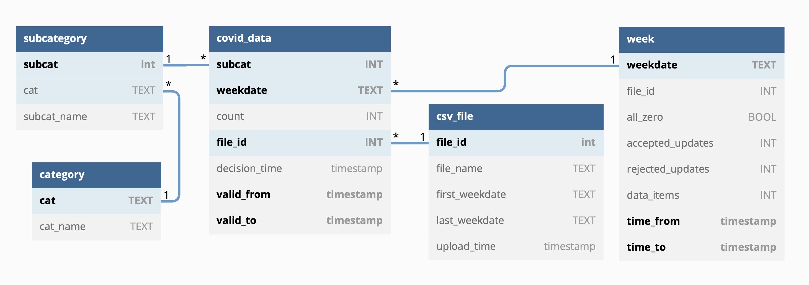

# Scottish COVID-19 Data Curation Interface 

### vcgalpin/links-covid-curation: Initial release 

This [Links](https://links-lang.org) prototype provides an interface to curate the weekly data available from 
*[National Records of Scotland](https://www.nrscotland.gov.uk/statistics-and-data/statistics/statistics-by-theme/vital-events/general-publications/weekly-and-monthly-data-on-births-and-deaths/deaths-involving-coronavirus-covid-19-in-scotland/archive)*. 

It allows for the uploading of individual CSV files, adds new data to the database, and indicates when there are new values for existing data. It uses the [temporal features of Links](https://github.com/links-lang/links/wiki/Temporal-Databases) to provide valid-time information about fatality counts. 

It also displays the data, as well as changes to the data, at three levels.
* Individual counts (specified by the week and subcategory that the data applies to)
* Grouped by week
* Grouped by subcategory

It supports the answering of questions such as the following.
* How do the Male and Female subcategories compare in terms of the change in fatalities? 
* How do the Male and Female subcategories
compare in terms of number of updates to existing values?

Note that this is a prototype hence some functionality has not
been implemented and not all buttons in the interface will respond.
The CSV file uploading makes the assumption that uploads will occur in the order
the files were originally released, and unexpected behaviour may occur for a different ordering of uploads. Additionally, the CSV files for upload which can be found in the `data` directory have been modified, and uploading the CSV files from the original site will result in errors.

### Temporal database usage

The database relation that stores the COVID-19 data is a valid-time table, and the one that stores information about weeks is atransaction-time table. Further details of the use of time is documented in the file [`uploadData.links`](src/uploadData.links). Examples of temporal feature usage can be found in the following files.

* **Sequenced insert:** [`uploadData.links: lines 100-111`](src/uploadData.links#L100)
* **Sequenced update:** [`uploadData.links: lines 167-174`](src/uploadData.links#L167)
* **Current query:** [`viewData.links: lines 83-51`](src/viewData.links#L38)
* **Nested selfjoin:** [`provQuery.links lines 96-108`](src/provQuery.links#L96)
* **Nonsequenced delete:** [`resetDB.links: line 17`](src/resetDB.links#L17)

### User interface

The interface is built using the [Links MVU library](https://github.com/links-lang/links/wiki/Model-View-Update-(Elm-Architecture)) which utilises
*[Bootstrap](https://getbootstrap.com)* and which is based on the Model-Update-View
paradigm. This separates the code for rendering
webpages into two functions: a view function which describes how
to render the current model information as HTML, and which returns
a message when there is interaction with the page. The update
function receives these messages, and makes modifications to the
model depending on the message. After this, the page is refreshed.
Typically, the database interactions occur when the initial model
is defined, and when the update function calls the functions it
needs for modifying the model, leading to a separation of concerns.

